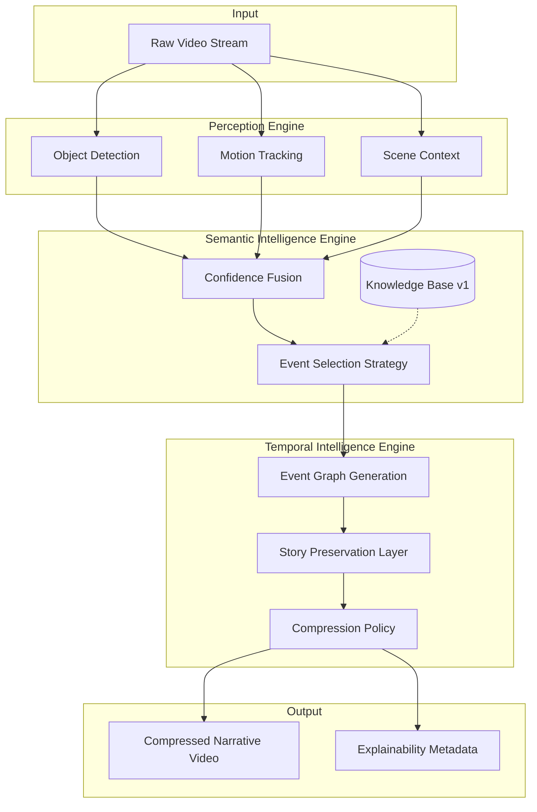

# Time Compression Engine
[](https://www.python.org/) [](https://nextjs.org/) [](https://fastapi.tiangolo.com/) [](https://www.postgresql.org/)

**"Hours of Video. Seconds of Truth."**

Time Compression Engine (TCE) is a research-grade AI video event summarization system designed to distil protracted video recordings into dense, narrative-preserving semantic summaries. Moving beyond simple motion detection, TCE employs a sophisticated three-engine architecture that parses raw perceptual signals, translates them into high-level semantic events using a knowledge-graph-backed taxonomy, and applies temporal intelligence to select events that maintain narrative coherence. This system addresses the fundamental limitation of traditional video surveillance and analysis by ensuring that the semantic causality of events is preserved while achieving extreme temporal compression ratios.

## Architecture Overview



## Feature Highlights
- **Semantic Event Recognition**: Knowledge-graph-backed event labelling, identifying complex occurrences like "person loitering" or "package delivered" rather than simple pixel changes.
- **Narrative-Preserving Compression**: Ensures causal sequences (e.g., person enters -> places object -> person exits) are maintained in the output, preventing context loss.
- **Explainable Decisions**: Every inclusion or exclusion of an event in the final summary includes a transparent reasoning chain.
- **Multi-Signal Confidence Fusion**: Aggregates object detection, motion tracking, and scene context into a unified confidence metric.
- **Event Graph Representation**: Models video events dynamically as a directed graph indicating causality and sequence.

## Technology Stack

| Layer | Technologies |
|---|---|
| **Frontend** | Next.js 14, React, Tailwind CSS, TypeScript |
| **Backend** | Python 3.11+, FastAPI, SQLAlchemy, Pydantic |
| **Database** | PostgreSQL 16 (asyncpg), Redis (Caching/Tasks) |
| **AI / ML** | PyTorch, YOLO, DINO (Phase 3+) |
| **Video Processing** | FFmpeg, OpenCV |

## Quick Start

### Using Docker Compose (Recommended)
```bash
# Clone the repository
git clone https://github.com/organization/time-compression-engine.git
cd time-compression-engine

# Copy environment variables
cp .env.example .env

# Start all services
docker-compose up -d --build
```
The API will be available at `http://localhost:8000` and the frontend at `http://localhost:3000`.

### Manual Setup
1. Ensure PostgreSQL and Redis are running locally.
2. Setup the backend:
   ```bash
   cd backend
   python -m venv venv
   source venv/bin/activate # or venv\Scripts\activate on Windows
   pip install -r requirements.txt
   uvicorn app.main:app --reload
   ```
3. Setup the frontend:
   ```bash
   cd frontend
   npm install
   npm run dev
   ```

## Project Structure (Top-Level)
```
time-compression-engine/
├── backend/            # FastAPI application and Python microservices
├── benchmark/          # Performance and evaluation benchmarks
├── docs/               # System architecture and API documentation
├── evaluation/         # Metrics and testing ground-truth
├── frontend/           # Next.js web application
├── knowledge/          # Versioned semantic knowledge base and taxonomies
└── research/           # Patent notes, algorithmic research, and ideas
```

## Roadmap

| Phase | Description | Status |
|---|---|---|
| **Phase 1** | Architecture Definition & Seed Infrastructure | Completed |
| **Phase 2** | Perception Engine - Baseline Implementation | Planned |
| **Phase 3** | Semantic Intelligence Engine Core | Planned |
| **Phase 4** | Temporal Intelligence Engine Core | Planned |
| **Phase 5** | Explainability Pipeline Integration | Planned |
| **Phase 6** | End-to-End Evaluation Framework | Planned |
| **Phase 7** | Frontend Dashboard MVP | Planned |
| **Phase 8** | Video Processing Pipeline Optimization | Planned |
| **Phase 9** | Advanced Multi-Signal Confidence Fusion | Planned |
| **Phase 10** | Event Graph Analytics UI | Planned |
| **Phase 11** | Knowledge Base v2 (Dynamic Rules) | Planned |
| **Phase 12** | Model Inference Optimization (TensorRT) | Planned |
| **Phase 13** | Edge Deployment Capabilities | Planned |
| **Phase 14** | Multi-Camera Correlation | Planned |
| **Phase 15** | Real-time Streaming Summarization | Planned |

## Research Contributions
Time Compression Engine introduces novel approaches to video summarization:
1. **Confidence Fusion Methodology**: A unique weighting mechanism across heterogeneous perceptual signals.
2. **Semantic Event Selection Strategy**: Bridging the gap between low-level vision and high-level knowledge representations.
3. **Narrative-Preserving Temporal Compression**: Formalizing story coherence as a quantifiable metric in video summarization.
4. **Explainable Event Selection**: Providing auditable reasoning chains for automated editing decisions.
5. **Event Graph Representation**: Structuring temporal data as causal graphs rather than linear timelines.

## License
MIT License. See `LICENSE` for details.
