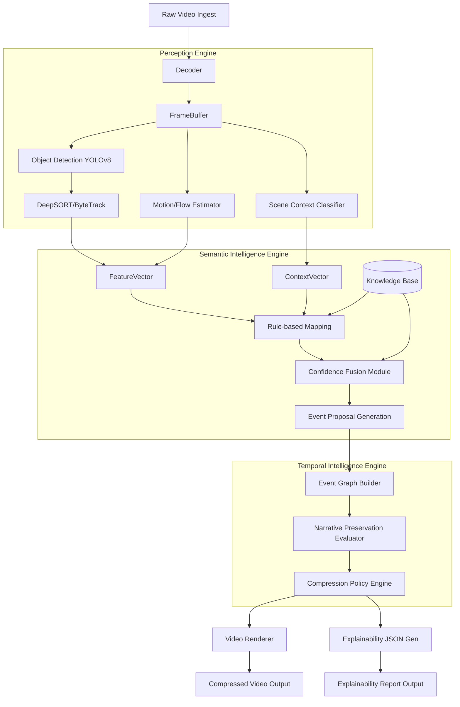

# System Architecture

The Time Compression Engine (TCE) is designed around a three-engine pipeline that progressively extracts higher-level meaning from raw video data.

## Full System Flow

## Module Interface Contracts

1. **Perception -> Semantic**: Passes normalized, tracked bounding boxes, motion vectors, and frame-level scene classifications. Data is high-frequency, low-level.
2. **Semantic -> Temporal**: Passes discrete proposed events (e.g., `{"event": "person_entered", "confidence": 0.88, "start": 1.2, "end": 4.5, "entities": ["p1"]}`). Data is low-frequency, high-semantic value.
3. **Temporal -> Output**: Passes a selected subset of temporal intervals to be rendered, along with the graph subgraph representing the reasoning.
