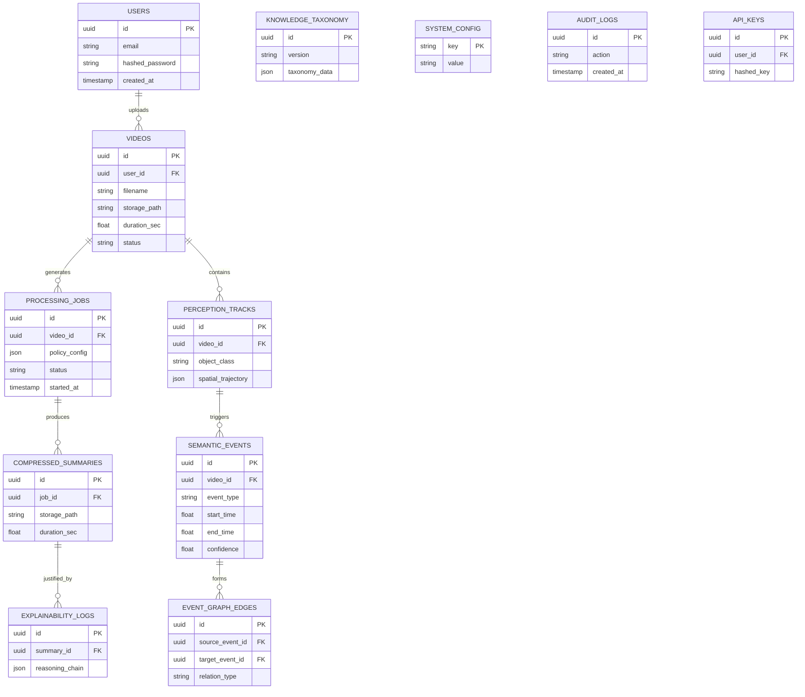

# Database Schema

```mermaid
erDiagram
    USERS ||--o{ VIDEOS : uploads
    VIDEOS ||--o{ PROCESSING_JOBS : generates
    VIDEOS ||--o{ PERCEPTION_TRACKS : contains
    PERCEPTION_TRACKS ||--o{ SEMANTIC_EVENTS : triggers
    SEMANTIC_EVENTS ||--o{ EVENT_GRAPH_EDGES : forms
    PROCESSING_JOBS ||--o{ COMPRESSED_SUMMARIES : produces
    COMPRESSED_SUMMARIES ||--o{ EXPLAINABILITY_LOGS : justified_by

    USERS {
        uuid id PK
        string email
        string hashed_password
        timestamp created_at
    }
    
    VIDEOS {
        uuid id PK
        uuid user_id FK
        string filename
        string storage_path
        float duration_sec
        string status
    }

    PROCESSING_JOBS {
        uuid id PK
        uuid video_id FK
        json policy_config
        string status
        timestamp started_at
    }

    PERCEPTION_TRACKS {
        uuid id PK
        uuid video_id FK
        string object_class
        json spatial_trajectory
    }

    SEMANTIC_EVENTS {
        uuid id PK
        uuid video_id FK
        string event_type
        float start_time
        float end_time
        float confidence
    }

    EVENT_GRAPH_EDGES {
        uuid id PK
        uuid source_event_id FK
        uuid target_event_id FK
        string relation_type
    }

    COMPRESSED_SUMMARIES {
        uuid id PK
        uuid job_id FK
        string storage_path
        float duration_sec
    }

    EXPLAINABILITY_LOGS {
        uuid id PK
        uuid summary_id FK
        json reasoning_chain
    }
    
    KNOWLEDGE_TAXONOMY {
        uuid id PK
        string version
        json taxonomy_data
    }
    
    SYSTEM_CONFIG {
        string key PK
        string value
    }
    
    AUDIT_LOGS {
        uuid id PK
        string action
        timestamp created_at
    }
    
    API_KEYS {
        uuid id PK
        uuid user_id FK
        string hashed_key
    }
```
